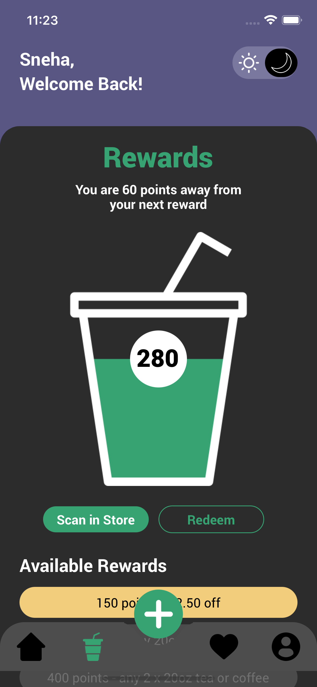
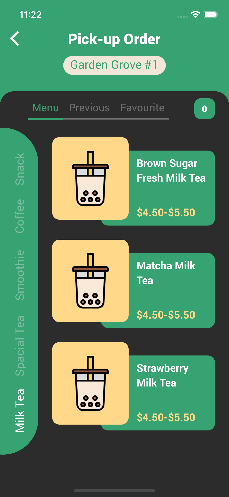

# Tea Shop App

Application is related to order the tea, coffee , Milkshake etc and also select the size of cup and also increse or decrease the quanty of sweetness, Milk and Ice in the ordered product as well. User has also Reward point to use for next order.

### This app has 5 bottom tabs

- Home
- Rewards
- AddOrder
- Favourite

## Features

- Light/Dark theme impliment, handled through Redux State management
- Home-> Dynamic Tob bar tabs , tabs move according to his text width, according to tab data showing, Animation used in flatlist.
- Reward-> here It will show all type of rewards
- Order-> in this screen there is two type of TabBar, Top tab bar, and Horrizontal TabBar according to tab data has changed.
- There is Increase and decrease the Size of cup and also increse or decrease the quanty of sweetness, Milk and Ice in the ordered producte with easy functionality and a good UI.

## Tech

Uses of tech in this application with version

- [React Native] - For reach UI and both the platform(Android & IOS) Version 0.64.4 enhanced for Mobile apps!
- [Navigation] - For navigation Bottom-tabs Navigation(Version-5.11.9), Stack Navigation(Versio-5.14.4)
- [React Redux] - for state management react-redux(Version-7.2.4), redux-thunk(Version-2.4.1) and redux(Version-4.1.0).
- [Svg] - react-native-svg(Version-12.3.0)
- [Javascript] - for logic implimentaion
- [git hub] - for code access

# Run Project Locally

This React Native project can be setup locally in <ins>_3 simple steps_</ins> and also assume that **_React Native Cli_**, **_Xcode_** and **_Android Studio_** is already installed.

1. Clone the repository from remote to local machine by using `https://github.com/singhsnehaa/MilkTeaShopApp.git` command in your terminal.

2. Navigate to the project folder by `cd MilkTeaShopApp` and install the dependencies by command `npm install` and `cd ios && pod install`

3. Run the project by using command `npx react-native run-ios` & `npx react-native run-android`

## APK file to check:

`https://github.com/singhsnehaa/MilkTeaShopApp/android/app/build/outputs/apk/debug/app-debug.apk`

# Few Images of our screen

- 
- 
- 
- 
