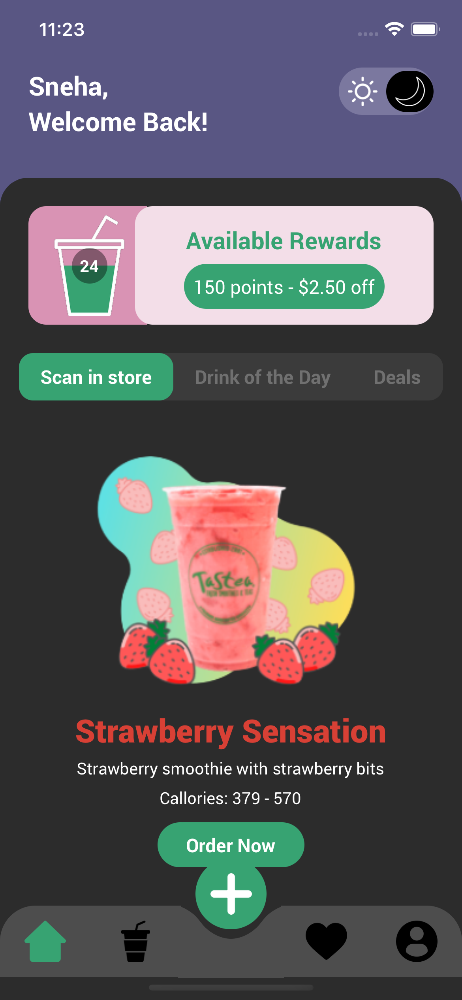
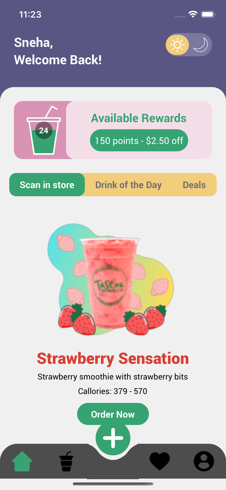
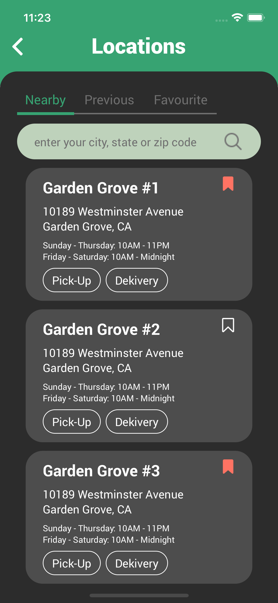
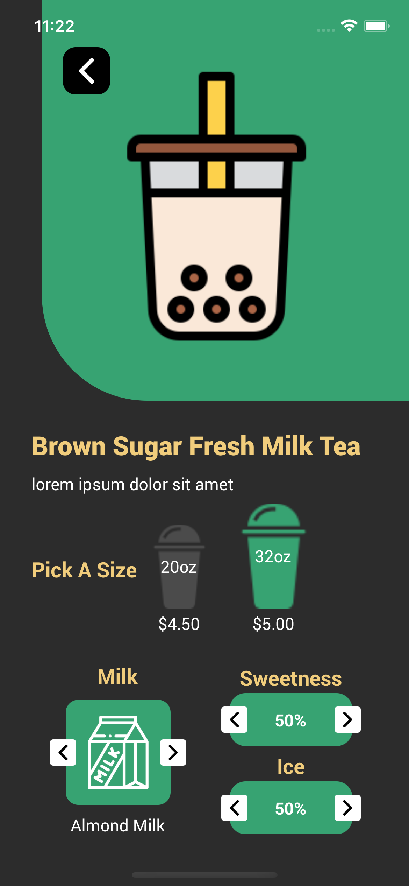

# Tea Shop App

The Tea Shop App allows users to order beverages like tea, coffee, and milkshakes. Users can customize their orders by selecting cup sizes and adjusting the sweetness, milk, and ice levels. Additionally, reward points can be earned and used for future purchases.

### This app has 5 bottom tabs

- Home
- Rewards
- AddOrder
- Favourite
- Profile

## Features

- Light/Dark theme support, managed via Redux.
- Home: Dynamic top bar tabs that adjust based on text width, with animation used in the FlatList.
- Rewards: Displays all available rewards.
- Order: Two tab bars are featured on this screen—a top tab bar and a horizontal tab bar—where the displayed data updates according to the selected tab.
- Users can easily increase or decrease cup size, sweetness, milk, and ice levels with an intuitive UI.

## Technology Stack

- [React-Native] - For a rich UI across both Android and iOS (version 0.64.4).
- [Navigation] - Bottom-tabs navigation (v5.11.9) and stack navigation (v5.14.4).
- [React-Redux] - fState management using react-redux (v7.2.4), redux-thunk (v2.4.1), and redux (v4.1.0).
- [Svg] - react-native-svg (v12.3.0). for circle and images.
- [Javascript] - For implementing logic.
- [git-hub] - For code version control.

# Run Project Locally

This React Native project can be setup locally in <ins>_3 simple steps_</ins> and also assume that **_React Native Cli_**, **_Xcode_** and **_Android Studio_** is already installed.

1.Clone the repository to your local machine using the command: `https://github.com/singhsnehaa/MilkTeaShopApp.git`

2. Navigate to the project folder using `cd MilkTeaShopApp` and install the dependencies by running: `npm install and cd ios && pod install`.

3. Run the project with the commands: `npx react-native run-ios` & `npx react-native run-android`

## APK File for Testing:

Download the APK file here: `https://github.com/singhsnehaa/MilkTeaShopApp/android/app/build/outputs/apk/debug/app-debug.apk`

# Screenshots of the app (Light and Dark modes):

  

-   
